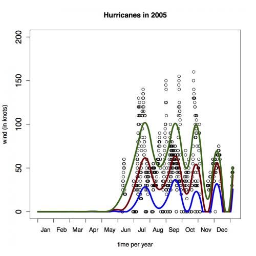

[](http://quantlet.de/index.php?p=info)

## [](http://quantlet.de/) **data_load_hurricanes** [](http://quantlet.de/d3/ia)

```yaml

Name of Quantlet: data_load_hurricanes

Published in: 'P. Burdejova, W.K. Härdle, P.Kokoszka and Q.Xiong (2015): Change
point and trend analyses of annual expectile curves of tropical storms'

Description: 'Loads original hurricane data, adjust data (order, missing values, 
delete zeros), compute and plot annual expectile curves'

Keywords: data adjustment, hurricane, expectile, curve, tropical storm

See also: P_beta_est.R

Author: Burdejova P.

Submitted:  

Datafile: Hurricanes.csv

Input: 

Output:  list of expectile curves, plot of annual expectile curves

Example: Annual hurricane expectile curves for year 2005

```




```r
rm(list = ls(all = TRUE))
graphics.off()

## install and load packages
libraries = c(“fda”, “expectreg”, "fields", "plyr")
lapply(libraries, function(x) if (!(x %in% installed.packages())) {
    install.packages(x)
})
lapply(libraries, library, quietly = TRUE, character.only = TRUE)

# Set working directory
# setwd("")

# read original data huricanes: 161 years (1851-2011)
orig.data = read.csv("Hurricanes.csv", sep = ";", header = TRUE)

data_mtx  = orig.data
n         = dim(data_mtx)[1] 

#DATA_MTX  columns description
#1. wind at 12am
#2. wind at 6am
#3. wind at 12 pm
#4. wind at 6pm
#5. year
#6. month 
#7. day

#correction of date when huricanes overlap a year 
for (row in 2: n) {
	if (data_mtx[row-1,6]==12 & data_mtx[row,6]==1){data_mtx[row,5] = data_mtx[row-1,5]+1}
	if (data_mtx[row,6]==1 & data_mtx[row-1,6]==1) {data_mtx[row,5] = data_mtx[row-1,5]}
}

eom = c(0, 31, 28, 31, 30, 31, 30, 31, 31, 30, 31, 30)  # number of days in previous month
Cumsum = function(x) {
    for (i in 2:length(x)) {
        # pardon the case where x is of length 1 or 0
        x[i] = x[i - 1] + x[i]
    }
    return(x)
}
cum_eom = Cumsum(eom)  #  number of days in previous months

# order of day, when 1.1.1851 is considered as first day
for (row in 1:n) {
    data_mtx[row, 8] = (data_mtx[row, 5] - 1851) * 365  # add days of previous years
    data_mtx[row, 8] = data_mtx[row, 8] + cum_eom[data_mtx[row, 6]]  #add days of previous months
    data_mtx[row, 8] = data_mtx[row, 8] + data_mtx[row, 7]  # days in current month
    
    data_mtx[row, 9] = 0
    data_mtx[row, 9] = data_mtx[row, 9] + cum_eom[data_mtx[row, 6]]  #add days of previous months
    data_mtx[row, 9] = data_mtx[row, 9] + data_mtx[row, 7]  # days in current month
    
    data_mtx[row, 10] = (data_mtx[row, 5] - 1850)
}

# DATA_MTX  new column description 
# 1. wind at 12am
# 2. wind at 6am
# 3. wind at 12 pm
# 4. wind at 6pm
# 5. year
# 6. month 
# 7. day
# 8. day order , when 1.1.1946 is considered as 1st day
# 9. day order per year, when 1.1.XXXX is considered as 1st day of every year
#10. year order , when 1946 is considered as 1st year

# save data as one vector, i.e. observation every 6hrs
data_vec           = matrix(nrow = 4 * n, ncol = 10)
colnames(data_vec) = c("wind", "year", "month", "day", "6hour_period", "year_order", 
    "day_order", "time_order", "day_order_py", "time_order_py")
for (row in 1:n) {
    for (hrs in 1:4) {
        # cat('row',row,'hrs',hrs, 'n')
        value                = data_mtx[row, hrs]
        j.coor               = ((row - 1) * 4) + hrs
        data_vec[j.coor, 1]  = value
        data_vec[j.coor, 2]  = data_mtx[row, 5]  #year
        data_vec[j.coor, 3]  = data_mtx[row, 6]  #month
        data_vec[j.coor, 4]  = data_mtx[row, 7]  #day
        data_vec[j.coor, 5]  = hrs
        data_vec[j.coor, 6]  = data_mtx[row, 10]  #year order
        data_vec[j.coor, 7]  = data_mtx[row, 8]  #day order
        data_vec[j.coor, 8]  = ((data_mtx[row, 8] - 1) * 4) + hrs  #time order
        data_vec[j.coor, 9]  = data_mtx[row, 9]  #day order per year
        data_vec[j.coor, 10] = ((data_mtx[row, 9] - 1) * 4) + hrs  #time order per year
    }
}

# correction deleting rows which dont go in order
data_vec = data.frame(data_vec)
arrange(data_vec, time_order)  # Use arrange from plyr package
data_vec = data_vec[order(data_vec$time_order), ]

# compute expetile curves output: 'expect_list' - object, a list with length 65
# (every year 1946-2010) of matrices 1460x9 (every 6 hour, 9 tau levels)
years_datalist = vector(mode = "list", length = 65)
expect_list = vector(mode = "list", length = 65)

for (year in 1947:2011) {
    cat(year)
    subdata                       = data_vec[data_vec[, 2] == year, c(1, 10)]
    years_datalist[[year - 1946]] = cbind(subdata[, 2], subdata[, 1])
    yeardata                      = years_datalist[[year - 1946]]
    xos                           = yeardata[, 1]
    xos_new                       = c(1:1460)
    yeardata_new                  = rep(0, 1460)
    for (i in 1:length(xos)) {
        yeardata_new[xos[i]] = yeardata[i, 2]
    }
    exp = expectreg.ls(yeardata_new ~ rb(xos_new, type = "pspline"), smooth = "aic", 
        expectile = c(1:9)/10)
        
    expfit                     = exp$fitted
    expfit[expfit < 0]         = 0
    colnames(expfit)           = c("tau0.1", "tau0.2", "tau0.3", "tau0.4", "tau0.5",
        "tau0.6", "tau0.7", "tau0.8", "tau0.9")
    expect_list[[year - 1946]] = expfit
}

# plot data
year      = 2005
yeardata  = years_datalist[[year - 1946]]
expfit    = expect_list[[year - 1946]]
plot_path = paste0(mainDir, "/typhoones", year, ".pdf")
pdf(plot_path)
plot(yeardata, main = "Hurricanes in 2005", xlab = "time per year", ylab = "wind (in knots)", 
    ylim = c(0, 200), axes = FALSE, xlim = c(1, 1460))
axis(side = 1, at = c(1, 120), labels = c("", ""))
axis(side = 1, at = c(1:12) * 120, labels = c(" ", " ", " ", " ", " ", " ", " ", 
    " ", " ", " ", " ", " "))
month_labels = c("Jan", "Feb", "Mar", "Apr", "May", "Jun", "Jul", "Aug", "Sep", "Oct", 
    "Nov", "Dec")
axis(side = 1, at = (c(1:12) * 120) - 60, tick = FALSE, labels = month_labels)
axis(side = 2, at = c(0, 50, 100, 150, 200), cex.axis = 1.3)
lines(xos_new, expfit[, 1], lty = 1, lwd = 4, col = "blue")
lines(xos_new, expfit[, 5], lty = 1, lwd = 4, col = "darkred")
lines(xos_new, expfit[, 9], lty = 1, lwd = 4, col = "darkgreen")
box()
dev.off() 

```
